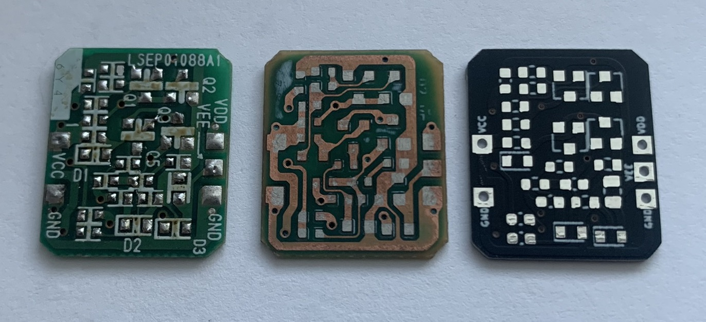
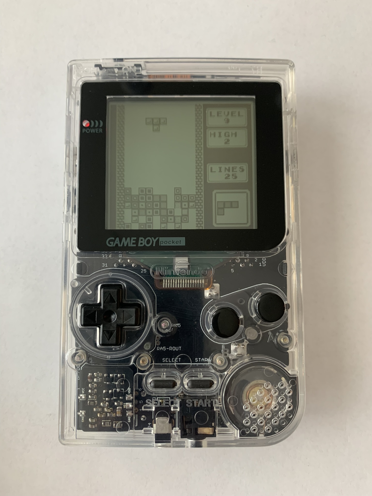

# Game Boy Pocket (MGB) DC/DC Board
"Reverse engineered" an OEM Game Boy Pocket MGB DC/DC Board (rev LSEP01088A1) and re-created it in KiCad.

I purchased a black one-to-one MGB PCB and transferred components from an OEM MGB; however, I did not like the color contrast between the green OEM DC/DC Board and the black mainboard PCB. There are other aftermarket options for a black DC/DC board, but I wanted to use the stock MGB screen so I needed to retain both the 5V and -18V rails.  

# Ordering and Assembly

Upload the gerber to a PCB fab (JLCPCB, PCBWay, OSHPark) with a board thickness of 0.8mm and in your favorite color.  Then transfer the components from an original MGB DC/DC Board (verify the correct polarity of the diodes when transferring).  

***Note:** this PCB can only be used with components from a revision LSEP01088A1 MGB DC/DC Board.*

# Disclaimer

You will need to transfer components from a working Game Boy Pocket DC/DC Board for this PCB to work.  Please do not undertake this if you are inexperienced in soldering; populating this PCB will require desoldering and micro-soldering surface mount components.  I do not take responsibility or accept blame for any damage to your Game Boy Pocket or MGB DC/DC Board. 

If you identify issues with the PCB design, please contact me on discord: *skimzor#5078*.

# Credit

- n64freak for producing the black one-to-one MGB PCBs.
- miketf1 and smelly-ghost for organizing the group buy for the black PCBs.

# License

 
 
This project/PCB is licensed under a Creative Commons Attribution-NonCommercial-ShareAlike 4.0 International License. ***Under this license, you are not permitted to profit from or commercialize this project.***
